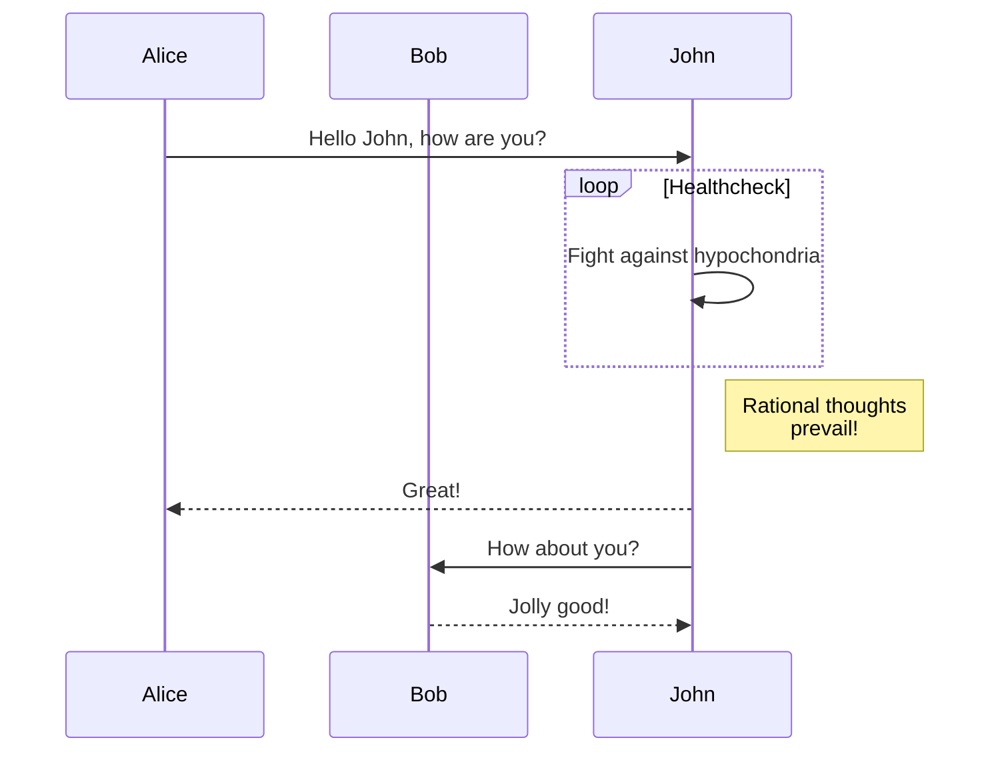

# Demo Heading

## Sub Heading 1

Lorem ipsum dolor sit amet consectetur adipisicing elit[^1]. Eligendi ipsam, pariatur illum odit beatae numquam ab fuga voluptas sequi maxime praesentium, atque amet doloribus nostrum, eveniet aliquam perferendis perspiciatis repellat?

### SubSub Heading 1.1

Lorem ipsum dolor sit amet consectetur adipisicing elit. Eligendi ipsam, pariatur illum odit beatae numquam ab fuga voluptas sequi maxime praesentium[^2],$A=\sum_{i=0}^{i<100}B_i + \int_{i=0}^{i=100}\frac{f(x)}{g(x)}dx$ atque amet doloribus nostrum, eveniet aliquam perferendis perspiciatis repellat?

$$
\lim_{x \to \infty} x^2_{22} - \int_{1}^{5}x\mathrm{d}x + \sum_{n=1}^{20} n^{2} = \prod_{j=1}^{3} y_{j}  + \lim_{x \to -2} \frac{x-2}{x}
$$

Lorem ipsum dolor sit amet consectetur adipisicing elit. Eligendi ipsam, pariatur illum odit beatae numquam ab fuga voluptas sequi maxime praesentium, atque amet doloribus nostrum, eveniet aliquam perferendis perspiciatis repellat?

```python
def batch_normalize(X, gamma, beta, epsilon=1e-5):
    mean = np.mean(X, axis=0) #[b,w,h,d]->[w,h,d]
    variance = np.var(X, axis=0)
    X_normalized = (X - mean) / np.sqrt(variance + epsilon)
    out = gamma * X_normalized + beta

    running_mean = momentum * running_mean + (1 - momentum) * x_mean
    running_var = momentum * running_var + (1 - momentum) * x_var
    return out, X_normalized, mean, variance
```

Lorem ipsum dolor sit amet consectetur adipisicing elit. Eligendi ipsam, pariatur illum odit beatae numquam ab fuga voluptas sequi maxime praesentium, atque amet doloribus nostrum, eveniet aliquam perferendis perspiciatis repellat?

$$
\begin{equation}
e^{i \pi} + 1 = 0
\end{equation}
$$

$$
\begin{equation}
\mathbf{A}^{-1}\vec{b} = \vec{x}
\end{equation}
$$

$$
\begin{equation}
 \int_\alpha^\beta f'(x) \, dx=f(\beta)-f(\alpha).
\end{equation}
$$

### SubSub Heading 1.2

Lorem ipsum dolor sit amet consectetur adipisicing elit. Eligendi ipsam, pariatur illum odit beatae numquam ab fuga voluptas sequi maxime praesentium, atque amet doloribus nostrum, eveniet aliquam perferendis perspiciatis repellat?[^3]



## Sub Heading 2

Lorem ipsum dolor sit amet consectetur adipisicing elit. Eligendi ipsam, pariatur illum odit beatae numquam ab fuga voluptas sequi maxime praesentium, atque amet doloribus nostrum, eveniet aliquam perferendis perspiciatis repellat?

### SubSub Heading 2.1

Lorem ipsum dolor sit amet consectetur adipisicing elit. Eligendi ipsam, pariatur illum odit beatae numquam ab fuga voluptas sequi maxime praesentium,$A=\sum_{i=0}^{i<100}B_i + \int_{i=0}^{i=100}\frac{f(x)}{g(x)}dx$ atque amet doloribus nostrum, eveniet aliquam perferendis perspiciatis repellat?


Lorem ipsum dolor sit amet consectetur adipisicing elit. Eligendi ipsam, pariatur illum odit beatae numquam ab fuga voluptas sequi maxime praesentium,$A=\sum_{i=0}^{i<100}B_i + \int_{i=0}^{i=100}\frac{f(x)}{g(x)}dx$ atque amet doloribus nostrum, eveniet aliquam perferendis perspiciatis repellat?

```c++
#include <iostream>
#include <cstdio>

using namespace std;

template<T>
T add(T lhs, T rhs) {
    return lhs + rhs;
}

int main(){
    int a = 23;
    int b = 54;
    int c = add(a,b);
    std::cout<<" c is: "<<c<<std::endl;
}
```

### SubSub Heading 2.2

Lorem ipsum dolor sit amet consectetur adipisicing elit. Eligendi ipsam, pariatur illum odit beatae numquam ab fuga voluptas sequi maxime praesentium,$A=\sum_{i=0}^{i<100}B_i + \int_{i=0}^{i=100}\frac{f(x)}{g(x)}dx$ atque amet doloribus nostrum, eveniet aliquam perferendis perspiciatis repellat?
<https://zizdlp.com>

!!! error hello this is error
    Note that Tailwind’s border reset is not applied to file input buttons. This means that to add a border to a file input button, you need to explicitly set the border-style using a class like file:border-solid alongside any border-width utility:
    $ A*i=B_i+\sum_i^jD*{ij}$
    Note that Tailwind’s border reset is not applied to file input buttons.

!!! note hello this is note
    Note that Tailwind’s border reset is not applied to file input buttons. This means that to add a border to a file input button, you need to explicitly set the border-style using a class like file:border-solid alongside any border-width utility:
    $ A*i=B_i+\sum_i^jD*{ij}$
    Note that Tailwind’s border reset is not applied to file input buttons.

!!! warning hello this is warning
    Note that Tailwind’s border reset is not applied to file input buttons. This means that to add a border to a file input button, you need to explicitly set the border-style using a class like file:border-solid alongside any border-width utility:
    $ A*i=B_i+\sum_i^jD*{ij}$
        Note that Tailwind’s border reset is not applied to file input buttons.
        ```python
        import pandas as pd
        def function(a,b):
            return a+b
        ```
!!! info hello this is info
    Note that Tailwind’s border reset is not applied to file input buttons. This means that to add a border to a file input button, you need to explicitly set the border-style using a class like file:border-solid alongside any border-width utility:
    $ A_i=B_i+\sum_i^jD_{ij}$
    Note that Tailwind’s border reset is not applied to file input buttons.

!!! tip hello this is tip
    Note that Tailwind’s border reset is not applied to file input buttons. This means that to add a border to a file input button, you need to explicitly set the border-style using a class like file:border-solid alongside any border-width utility:
    $ A*i=B_i+\sum_i^jD*{ij}$
    Note that Tailwind’s border reset is not applied to file input buttons.
    ```python
    import pandas as pd
    def function(a,b):
        return a+b
    ```

### SubSub Heading 2.3

Lorem ipsum dolor sit amet consectetur adipisicing elit. Eligendi ipsam, pariatur illum odit beatae numquam ab fuga voluptas sequi maxime praesentium,$A=\sum_{i=0}^{i<100}B_i + \int_{i=0}^{i=100}\frac{f(x)}{g(x)}dx$ atque amet doloribus nostrum, eveniet aliquam perferendis perspiciatis repellat?

| col1 | col2 | col3 | col4 |
| ---- | ---- | ---- | ---- |
| row1 | row1 | row1 | row1 |
| row1 | row1 | row1 | row1 |
| row1 | row1 | row1 | row1 |
| row1 | row1 | row1 | row1 |

[^1]: Note that Tailwind’s border reset is not applie Note that Tailwind’s border reset is not applie Note that Tailwind’s border reset is not applie
[^2]: Note that Tailwind’s border reset is not applie
[^3]: Note that Tailwind’s border reset is not applie Note that Tailwind’s border reset is not applie
