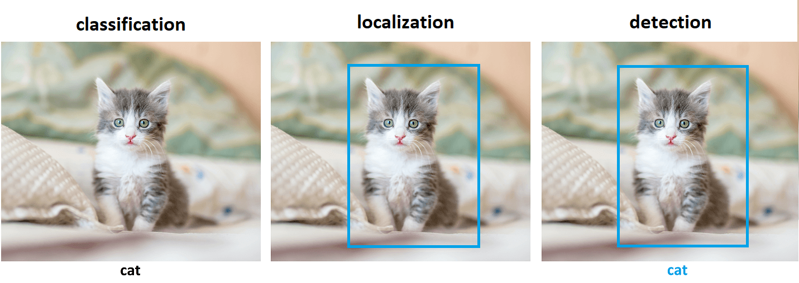
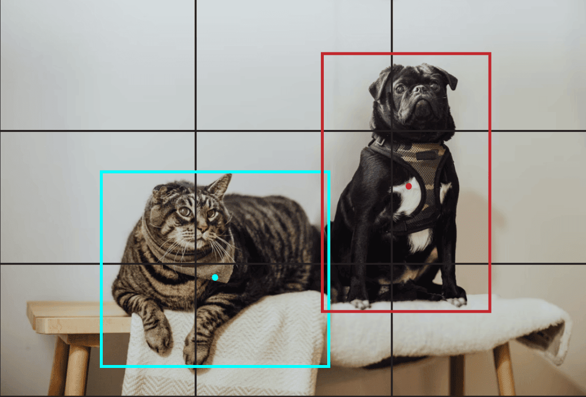
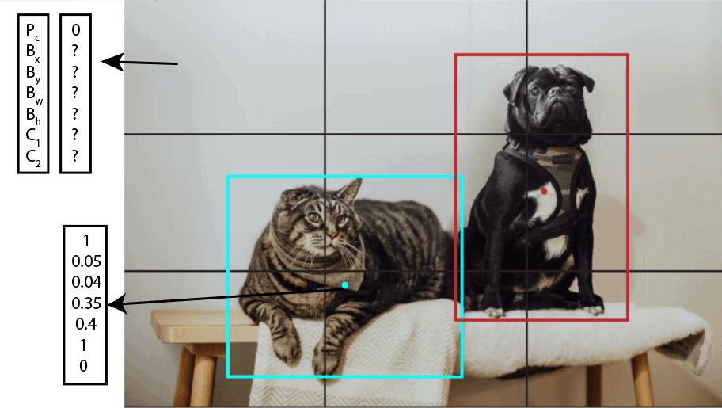
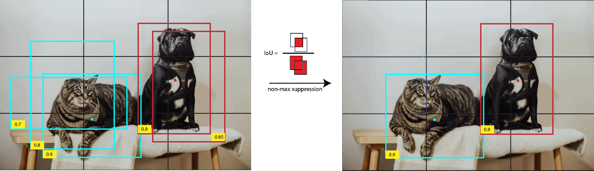
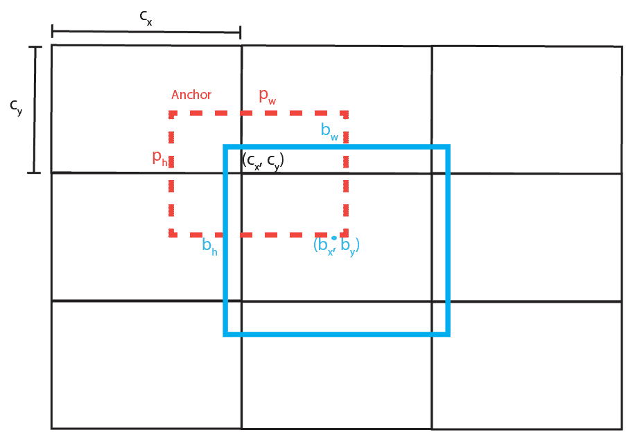

# What Is YOLO Algorithm?[^1]

## 1. Introduction

In this tutorial, we’ll probably present one of the most popular algorithms for object detection with the name YOLO. YOLO is an acronym for “You Only Look Once” and it has that name because this is a real-time object detection algorithm that processes images very fast. Here, we’ll explain how it works and some applications of this algorithm.

## 2. Object Detection

**Object detection is the task of detecting instances of objects of a specific class within an image or video.** Basically, it locates the existence of objects in an image using a bounding box and assigns the types or classes of the objects found. For instance, it takes an image as input and generates one or more bounding boxes, each with the class label attached. These algorithms are powerful enough to handle multi-class classification and localization and objects with multiple occurrences.

Object detection is a combination of two tasks:

- Image classification
- Object localization

Image classification algorithms predict the type or class of an object in an image among a predefined set of classes that the algorithm was trained for. Usually, input is an image with a single object, such as a cat. Output is a class or label representing a particular object, often with a probability of that prediction.

Object localization algorithms locate the presence of an object in the image and represent its location with a bounding box. They take an image with one or more objects as input and output the location of one or more bounding boxes using their position, height, and width.

### 2.1 Object Detection Methods

Generally, object detection methods can be classified as either neural network-based or non-neural approaches. Also, some of them are rule-based, where the rule is predefined to match specific objects. Non-neural approaches require defining features using some feature engineering techniques and then using a method such as a support vector machine (SVM) to do the classification.

**Some of the non-neural methods are:**

- Viola-Jones object detection method based on Haar features
- Scale-invariant feature transform (SIFT)
- Histogram of Oriented Gradients (HOG)
- Other methods based on template, shape, or color matching

On the other hand, neural network techniques can do end-to-end object detection without explicitly defining features. They are far more accurate than non-neural based and are typically built on [convolutional neural networks (CNN)](https://www.baeldung.com/cs/deep-cnn-design#convolutional-neural-networks).

**Some of the neural network methods are:**

- Region-Based Convolutional Neural Networks (R-CNN, Fast R-CNN, etc.)
- Single Shot Detector (SSD)
- Retina-Net
- You Only Look Once (YOLO)

### 2.2. Challenges in Object Detection

In object detection, the bounding boxes are always rectangular. As a result, if the object contains the curvature part, it does not help determine its shape. In order to find precisely the shape of the object, we should use some of the image segmentation techniques.

Some non-neural methods may not detect objects with high accuracy or may produce a large number of false-positive detections. Although neural network methods are more accurate, there are some drawbacks. For example, they require a large amount of annotated data for training. Training is often expensive in time and space and, as a result, prolonged on standard computers.

**In order to solve these challenges, we can use the YOLO algorithm.** Thanks to the [transfer learning capabilities](https://www.baeldung.com/cs/transfer-learning-vs-domain-adoption#transfer-learning), we would be able to use already pre-trained models or spend some time fine-tuning models with our data. Furthermore, the YOLO algorithm is one of the most popular methods for performing object detection in real-time because it achieves high accuracy on most real-time processing tasks while maintaining a reasonable speed and frames per second, even on devices accessible to almost everyone.

## 3. You Only Look Once (YOLO)

You Only Look Once (YOLO) is one of the most popular model architectures and object detection algorithms. It uses one of the best neural network architectures to produce high accuracy and overall processing speed, which is the main reason for its popularity. If we search Google for object detection algorithms, the first result will be related to the YOLO model.

YOLO algorithm aims to predict a class of an object and the bounding box that defines the object location on the input image. It recognizes each bounding box using four numbers:

Center of the bounding box $(b_{x}, b_{y})$
Width of the box $(b_{w})$
Height of the box $(b_{h})$
In addition to that, YOLO predicts the corresponding number c for the predicted class as well as the probability of the prediction $(P_{c})$

### 3.1. How Does YOLO Work?

Let’s say that we have an image with two bounding boxes representing a cat and dog. The first step that YOLO does is dividing the image into a grid. For example, a 3×3 grid as below:

With the existence of a grid, it’s possible to detect one object per grid cell instead of one object per image. For each grid cell, we can encode a vector that will describe the cell. For instance, the first cell from the top-left doesn’t have any object, and we describe it as:

$$
\begin{equation} C_{1, 1} = (P_{c}, B_{x}, B_{y}, B_{w}, B_{h}, C_{1}, C_{2}) = (0, ?, ?, ?, ?, ?, ?), \end{equation}
$$

where (P*{c}) is the probability of the object class, B*{x} and B*{y} are coordinates of the center of the bounding box, relative to the cell, B*{x} and B*{y} are width and height of the bounding box relative to the whole image, C*{1} and C\*{2} are 0 or 1 depending on which class represents the bounding box ($C_{1}$ for cat and $C_{2}$ for dog). Vector $(C_{1, 1})$ consists of symbols ? because if the first component $(P\_{c})$ is equal to zero, then the rest of the components can have random numbers are they are not taken into consideration.

Next, if we take the cell that contains the center of the blue bounding box with the cat, we’ll have a vector

$$
 \begin{equation} C_{3, 2} = (1, 0.05, 0.04, 0.35, 0.4, 1, 0). \end{equation}
$$

Following this procedure, if we define one vector for each grid cell, the whole image is represented with nine vectors with size 7 or 3x3x7 tensor. This means that in our data set, each image sample is labeled with one 3x3x7 tensor. Using that data set, we are able to create a training and test set and train the convolutional network, which is exactly how YOLO works.

Using CNN, YOLO is able to predict all objects in one forward pass and that is the reason for its full name “You Only Look Once”.

### 3.2. Non-Max Suppression

One issue that might happen is when the algorithm predicts several bounding boxes for one class. We could select only one box per class, that has the highest probability, but what if there are more objects of one class on the image (for example a few cats). Because of that, we’ll use a non-max suppression algorithm.

First, we take the box with the maximum probability. After that, we compare the box with all other boxes of that particular class using [intersection over union (IoU)](https://www.baeldung.com/cs/object-detection-intersection-vs-union). Generally, this metric is also known as the Jaccard index but in computer vision, the name IoU is used. The formula of IoU is

$$
\begin{equation} IoU = \frac{\text{area of the intersection between } B_{1} \text{ and } B_{2}}{\text{area of the union between } B_{1} \text{ and } B_{2}}, \end{equation}
$$

where $B_{1}$ and $B_{2}$ are two bounding boxes.

If the IoU is higher than the predefined threshold (for example 0.5), then the box with a smaller probability is suppressed or excluded. It means that two boxes with high IoU values probably indicate the same object on the image, so we exclude the box with a lower probability. This process is repeated until all boxes are taken as object prediction or excluded.

### 3.3. Vector Generalization

In this article, we mentioned that one object can be predicted per one grid cell. Generally, it doesn’t need to be only one object. The authors used two boxes per cell in the original paper that can only have one class. Basically, the vector that defines the cell will have two times more components that define the probability of the object and the dimension of the boxes. For example

$$
\begin{equation} C_{1, 1} = (P^{1}_{c}, B^{1}_{x}, B^{1}_{y}, B^{1}_{w}, B^{1}_{h},  P^{2}_{c}, B^{2}_{x}, B^{2}_{y}, B^{2}_{w}, B^{2}_{h}, C_{1}, C_{2}), \end{equation}
$$

where the notation is already explained except the superscript number that indicates the bounding box index.

Similarly, instead of predicting only two classes, it’s possible to define as many classes as we need. Of course, it’ll influence the algorithm’s accuracy, so the authors used a maximum of 20 classes. Also, in order to detect more objects, we can increase the dimension of the grid.

Generally, we can describe each cell using a vector with dimension $B\times 5 + C$ where B is the number of bounding boxes, and C is the number of classes. If the image is divided into $S\times S$ grid then it can be represented using $S\times S \times (B\times 5 + C)$ tensor.

## 4. Improvements

So far described procedure for the YOLO algorithm refers to its first version v1. The new version v2 could predict even 9000 different object classes and still run in real-time. YOLO v2 introduces the concept of anchor boxes.

## 4.1. Anchor Boxes

Instead of making arbitrary guesses on the boundary boxes, in YOLO v2 authors defined 5 anchor boxes with predefined width and height. To identify the most appropriate dimension of the boxes, k-means clustering is used on the dimensions of bounding boxes from the data set, with distance metric based on IoU

$$
\begin{equation} d(box, centroid) = 1 - IoU(box, centroid). \end{equation}
$$

To make it clear, YOLO v2 doesn’t use anchor boxes to slide over the image and compare them with objects. Instead of that, it makes predictions on the offsets to the anchors. Basically, it predicts parameters $t*{x}, t*{y}, t*{w}$ and $t*{h}$ which are used to calculate real bounding box coordinates and dimension in a way

$$
\begin{aligned}
b_{x} &= \sigma(t_{x}) + c_{x} \\
b_{y} &= \sigma(t_{y}) + c_{y} \\
b_{w} &= p_{w}e^{t_{w}} \\
b_{h} &= p_{h}e^{t_{h}}  \tag{6}
\end{aligned}
$$

where $p_{w}$ and $p_{h}$ are the width and height of the anchor, $c_{x}$ and $c_{y}$ is the top left corner of the current grid cell and $\sigma$ sigmoid function. These parameters are explained in the image below:

## 4.1. Further Improvements

The subsequent versions of the YOLO algorithm brought some additional changes. Besides minor changes, YOLO v3 used a more complex CNN architecture with 53 convolutional layers instead of 19 in the last version. Next, version v4 introduced several new concepts such as weighted residual connections, cross-stage partial connections, CIoU loss, and other features.

YOLO v5 added further improvements related to data augmentation and auto-learning bounding boxes. [Everything was nicely written in PyTorch, with many tutorials and tips on training and using the model](https://github.com/ultralytics/yolov5).

After v5, some new modifications were introduced, such as PP-YOLO, YOLOR, and YOLOX, but we won’t explain them in this article.

## 5. Applications

YOLO has a wide range of real-world applications because it solves one of the most common computer vision problems, object detection. Some of them are:

- Autonomous driving – YOLO can be used in autonomous vehicles for detecting objects such as cars, people, traffic signs, and similar
- Security – for example, detecting people in restricted areas
- Manufactory – detecting anomalies in production
- Sport – tracking players and many others

## 6. Conclusion

In this article, we presented one of the most powerful algorithms for object detection called YOLO. After a short introduction about object detection and some other methods, the logic of the YOLO algorithm with the most important concepts is explained in detail. In the end, we mentioned some newer improvements as well as applications.

This article is a theoretical explanation of the YOLO method, but there are a lot of practical resources available, for example, [YOLO v5 repository](https://github.com/ultralytics/yolov5), and for sure, it should be the first choice when it’s about solving objects detection problems.

[^1]: [https://www.baeldung.com/cs/yolo-algorithm](https://www.baeldung.com/cs/yolo-algorithm)
