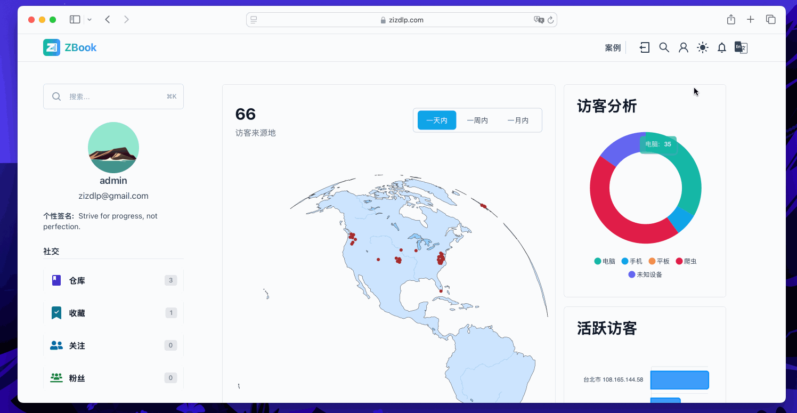

# Language Support

## Frontend

ZBook currently supports Simplified Chinese and English. To add support for new languages to the frontend part of ZBook, follow these steps:

### 1. Add Language Files

Create a new language file in the `zbook_frontend/messages` directory, such as `fr.json`, and add the corresponding translation content. For example:

```json
{
  "welcome": "Bienvenue",
  "login": "Se connecter",
  "register": "S'inscrire",
  "dashboard": "Tableau de bord"
}
```

Ensure that you provide translation content for each field that needs to be translated.

### 2. Update Language Configuration

In the `zbook_frontend/src/navigation.ts` file, add the new language to the `locales` configuration. For example, if you are adding support for French, do the following:

```typescript
import frMessages from "../messages/fr.json";

// Add the new language to the locales object
const locales = {
  en: enMessages,
  zh: zhMessages,
  fr: frMessages, // Add new language
};
```

### 3. Update Global Type Definitions

In the `zbook_frontend/global.d.ts` file, add type declarations for the new language. You might need to update interfaces or type definitions to include the new language. For example:

```typescript
declare module "i18n" {
  type Locale = "en" | "zh" | "fr"; // Add new language type
}
```

### 4. Navbar Language Switching

To implement language switching in the `navbar`, update the corresponding component to support selecting languages from `localeMap`. If you have a `Navbar` component, update the `zbook_frontend/src/components/navbars/NavLang.tsx` file with the `localeMap`:

```typescript
const localeMap = {
  en: "English",
  zh: "简体中文",
  de: "Deutsch",
  fr: "Français",
  es: "Español",
  jp: "日本語",
  ko: "한국어", // Add new languages
};
```

### 5. Testing

After completing the above steps, you should test the changes. Navigate to the `zbook_frontend` directory and run `npm run lint` and `npm run build`. If there are no errors, you can start the local server and check the results.

## Backend

The dashboard can support geographic information in multiple languages. This is somewhat decoupled from the frontend. If the backend does not have corresponding language database information, it will return default language `en` information as shown in the image below:



If you need to add backend support for corresponding languages, you need to update both the backend and the database. For example:

```go
func getCityName(record *util.GeoInfo, lang string) string {
    switch lang {
    case "en":
      return record.CityNameEn
    case "zh_cn":
      return record.CityNameZhCn
    default:
      return record.CityNameEn
    }
}
```

!!! warning TODO
    Instructions for adding languages to the backend are incomplete. You can start by adding the frontend part only.
