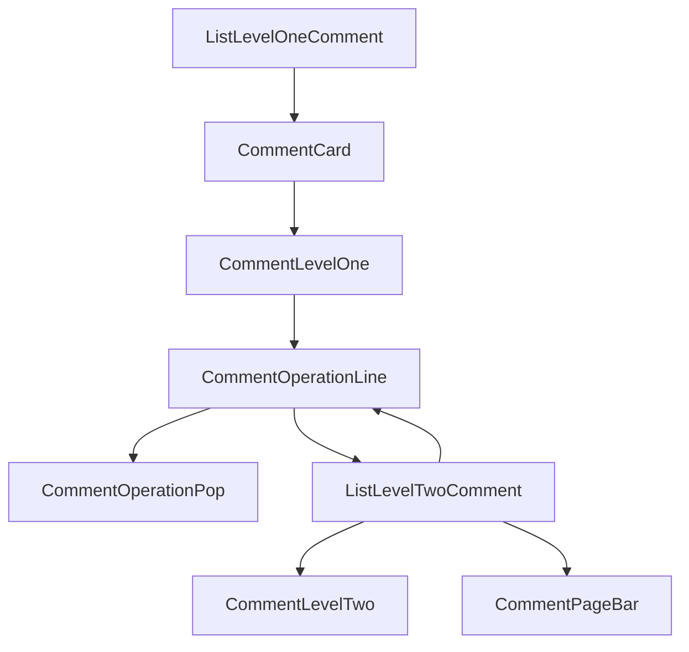

# Comments

Users can leave comments under repository files. These comments are visible only to logged-in users and can be replied to, favorited, downvoted, or reported. For reports, a summary will appear on the administrator's dashboard, where actions such as deleting comments, notifying users, or blocking users can be taken.

## Comment Reporting

The following screenshot shows an example of reporting a comment. Users can report a comment by providing a reason and submitting the report. Administrators can then review the reports and take appropriate actions.

Frontend comments involve multiple components. The following Mermaid flowchart shows the invocation relationships between the components used for comments.

