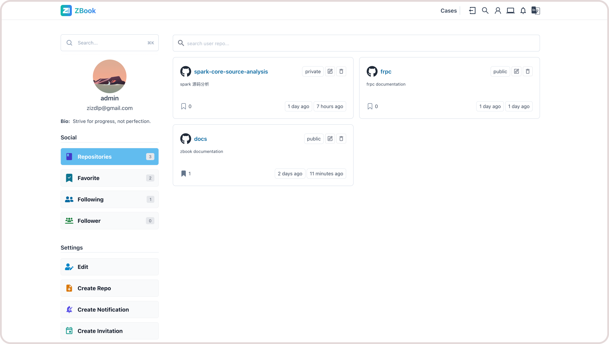
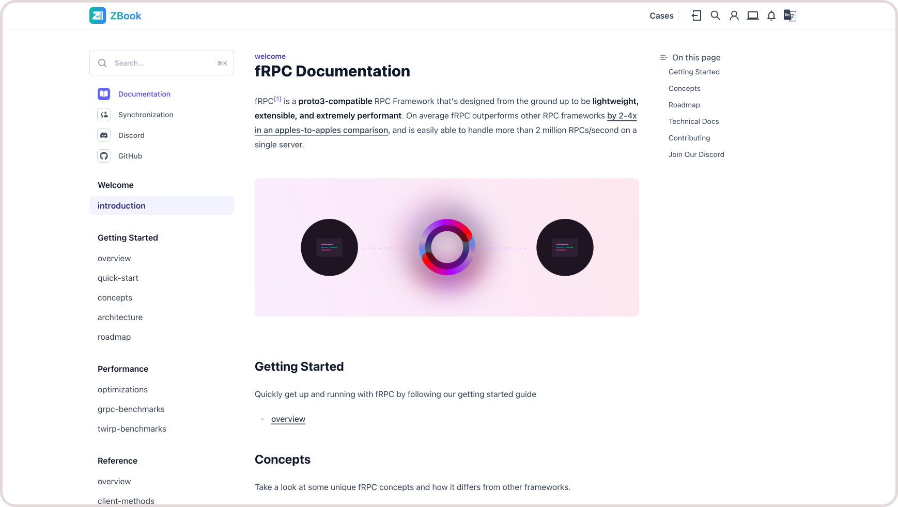

# Core Features

ZBook supports multi-user management, allowing users with different roles to perform operations based on their permissions. Each user can independently create or manage their own repositories, edit personal information, view access analytics, and link third-party accounts (such as GitHub, GitLab, etc.). Administrators can assign different permission levels to ensure secure access and manage the core functions of the site. The flexible multi-user functionality is suitable for individual developers, team collaboration, and large organizations, providing an efficient management experience for users.

ZBook offers simple Markdown repository rendering, supports various theme styles, colors, multi-language support, night mode, and full-text search in multiple languages.

## Comparison

Below is a comparison table between ZBook, MkDocs, and other similar platforms (such as GitBook and Docusaurus) to help you understand the features and differences of each platform:

| Feature/Platform           | ZBook                                          | MkDocs                             | GitBook                          | Docusaurus                       |
| -------------------------- | ---------------------------------------------- | ---------------------------------- | -------------------------------- | -------------------------------- |
| **Open Source**            | Yes                                            | Yes                                | No (Core features free)          | Yes                              |
| **Self-Hosted**            | Yes                                            | Yes                                | No                               | Yes                              |
| **Free to Use**            | Yes                                            | Yes                                | Core features free               | Yes                              |
| **Multi-User Support**     | Yes                                            | No                                 | Yes (Paid users only)            | No                               |
| **Permission Management**  | Yes                                            | No                                 | Yes (Paid users only)            | No                               |
| **Multi-Language Support** | Yes                                            | Yes                                | Yes                               | Yes                              |
| **Plugin Extensions**      | Yes                                            | Yes                                | Yes                               | Yes                              |
| **Markdown Support**       | Yes                                            | Yes                                | Yes                              | Yes                              |
| **Search Functionality**   | Yes                                            | Yes (Built-in)                     | Yes                              | Yes                              |
| **Theme Customization**    | Yes                                            | Yes                                | No (Limited in paid version)     | Yes                              |
| **Comment System**         | Yes                                            | No                                 | No                               | No                               |
| **Sync Support**           | Yes (Manual & Automatic)                       | Yes (Manual)                       | Yes (Git integration)            | Yes (Git integration)            |
| **Version Control**        | Yes                                            | Yes                                | Yes                              | Yes                              |
| **Integration**            | GitHub, GitLab, etc.                           | GitHub, GitLab                     | GitHub                           | GitHub, GitLab                   |
| **Community Support**      | Yes,Limited                                             | Active                             | Active                           | Active                           |
| **Visitor Analytics**      | Yes                                            | No                                 | No                               | No                               |
| **Deployment Complexity**  | Low                                            | Low                                | Low                              | Medium                           |
| **Suitable Scenarios**     | Multi-user, Permission Management, Self-hosted | Lightweight documentation projects | Small teams, individual projects | Large projects, community-driven |

### **Summary**

- **ZBook**: Ideal for projects requiring self-hosting, permission management, and multi-user support, especially suitable for development teams and enterprises.
- **MkDocs**: Lightweight and easy to use, suitable for individuals or small projects, focused on quick document generation.
- **GitBook**: Suitable for small teams needing easy onboarding and hosted services, but advanced features require payment.
- **Docusaurus**: A powerful documentation platform, ideal for large community projects with excellent plugin and theme extension capabilities.
