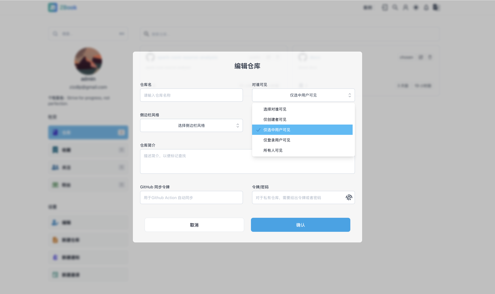

# Permission Management

Users can create repositories with different visibility permissions, including `Only Creator Visible`, `Only Logged-in Users Visible`, `Visible to Everyone`, and `Visible to Selected Users Only`. As the names suggest, `Only Logged-in Users Visible` means that only logged-in users can view the repository contents, while `Visible to Selected Users Only` means that only the selected group of users can view the repository.

## Selected Users

When a user sets a repository to `Visible to Selected Users Only`, a `Who Can See` button will appear in the repository sidebar. Clicking this button will show who can view this repository, and the `Add` button allows adding new users.

!!! Tip
    The visibility of the repository owner cannot be changed here. Regardless of whether the owner is listed or not, the repository owner will always be able to see the repository.

