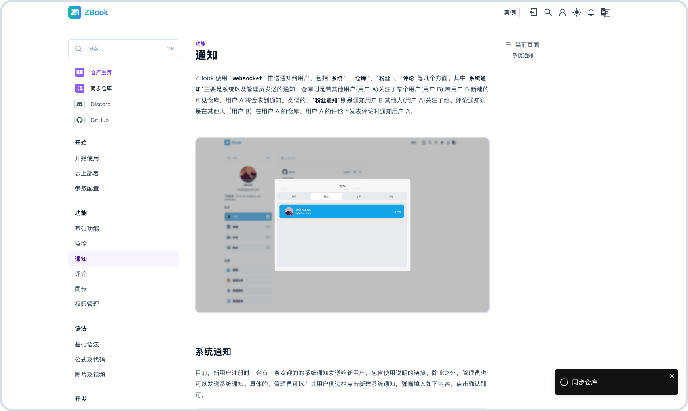

# Synchronization

ZBook repositories can be configured for either manual or automatic synchronization. For manual synchronization, click on "Sync Repository" in the repository sidebar. For GitHub repositories, automatic synchronization can be achieved using GitHub Actions.



To configure GitHub Actions for ZBook repositories, you need to create a YAML file in the `.github/workflows/` directory to define the automated CI/CD process. Here is an example GitHub Actions configuration for automatically synchronizing a ZBook repository:

Create a file named `.github/workflows/main.yml` in the root directory of your ZBook repository. This file will contain the GitHub Actions configuration.

```yaml
name: Auto Sync

on:
  push:
    branches:
      - main

jobs:
  auto_sync:
    runs-on: ubuntu-latest
    steps:
      - name: Deploy Stage
        run: |
          # Enable error handling
          set -e

          # Execute the API request and capture the response
          URL="${{ secrets.ZBOOK_URI }}?username=${{ secrets.ZBOOK_USERNAME }}&sync_token=${{ secrets.ZBOOK_SYNC_TOKEN }}&repo_name=${{ secrets.ZBOOK_REPO_NAME }}"

          RESPONSE=$(curl -X GET "$URL" \
            -H 'Content-Type: application/json' \
            --max-time 600)

          # Output the response content
          echo "Response: $RESPONSE"

          # Check if the response contains the expected status code or key fields
          STATUS_CODE=$(echo "$RESPONSE" | grep -oP '(?<="status":)\d+' || echo "200")

          if [ "$STATUS_CODE" -ne 200 ]; then
            echo "Error: API request failed with status code $STATUS_CODE"
            exit 1
          fi

          echo "API request successful."
```

In the GitHub repository's Secrets, you need to configure the following variables:

| Parameter           | Description                                              |
| ------------------- | -------------------------------------------------------- |
| `ZBOOK_URI`         | The URI of the target API, e.g., `https://zizdlp.com/api/sync` |
| `ZBOOK_REPO_NAME`   | The name of the current project's repository, e.g., `docs` |
| `ZBOOK_USERNAME`    | The username, e.g., `admin`                              |
| `ZBOOK_SYNC_TOKEN`  | The synchronization token used for authentication, provided when the repository was created |

With this GitHub Actions configuration, every time code is pushed to the `main` branch, the synchronization operation will be automatically triggered, synchronizing the code and related information to the specified target system.