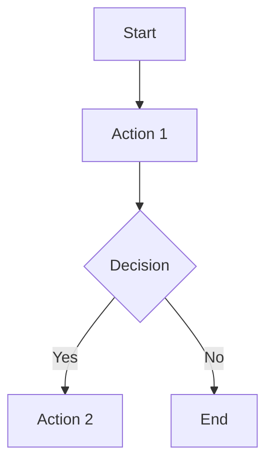

# Formulas and Code

ZBook provides robust support for formulas and code, allowing users to easily insert mathematical formulas and programming code into documents, meeting the needs of various academic and development documents.

## Formula Support

ZBook supports LaTeX syntax, enabling users to write complex mathematical formulas and embed them directly into Markdown documents. Here are some examples:

### Inline Formulas

Inline formulas are used to insert simple mathematical expressions within the text:

```markdown
This is an inline formula: `$E = mc^2$`, which represents the relationship between energy and mass.
```

**Effect**: This is an inline formula: $E = mc^2$, which represents the relationship between energy and mass.

### Block Formulas

Block formulas are used for more complex formulas, typically displayed on a separate line:

```markdown
$$
\int_{a}^{b} f(x) \, dx = F(b) - F(a)
$$
```

**Effect**:

$$
\int_{a}^{b} f(x) \, dx = F(b) - F(a)
$$

## Code Support

ZBook allows users to insert code blocks with syntax highlighting, suitable for various programming languages. Users can easily showcase code examples and improve readability with syntax highlighting.

### Inline Code

Inline code is used to insert short snippets of code or commands within the text:

```markdown
Use `print("Hello, World!")` to output information.
```

**Effect**: Use `print("Hello, World!")` to output information.

### Block Code

Block code is used to display multiple lines of code. Users can specify the code language to enable syntax highlighting:

````markdown
```python
def hello():
    print("Hello, World!")
```
````

**Effect**:

```python
def hello():
    print("Hello, World!")
```

### Syntax Highlighting

ZBook supports syntax highlighting for various programming languages, including Python, JavaScript, Go, and more. Here is a JavaScript code example:

````markdown
```javascript
function greet(name) {
  return `Hello, ${name}!`;
}
```
````

**Effect**:

```javascript
function greet(name) {
  return `Hello, ${name}!`;
}
```

## Mermaid Support

ZBook supports the use of Mermaid syntax to create various types of diagrams, including flowcharts, sequence diagrams, class diagrams, and more, making document content more visual.

### Flowchart Example

Here is a simple flowchart example:

````markdown

````

**Effect**:

