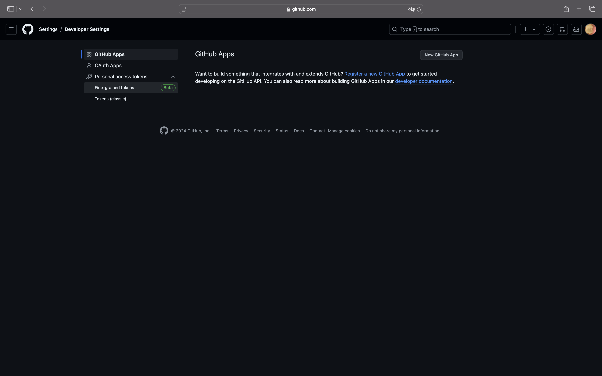
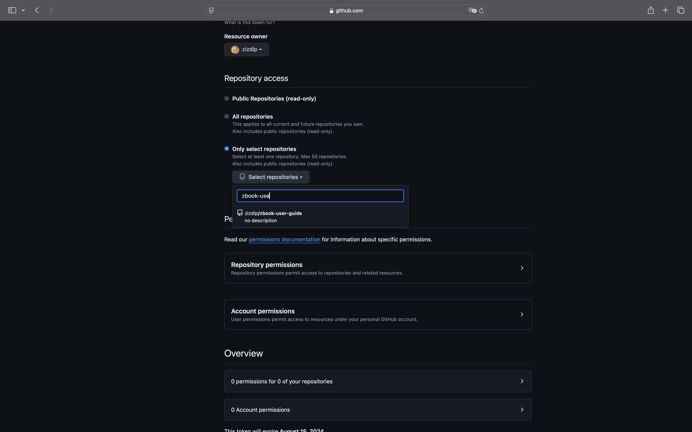
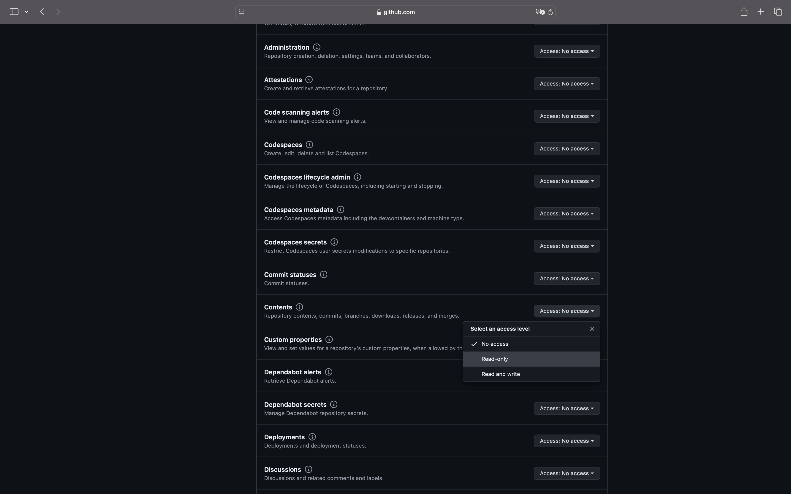

# GitHub 细粒度令牌

> GitHub 提供了令牌（token）来进行身份验证和授权，可以通过令牌实现细粒度的权限控制。以下是一些步骤和示例，演示如何使用 GitHub 令牌来实现有限的权限赋权：

## 创建 GitHub 令牌

1. **登录 GitHub 账号**：
   确保你已登录 GitHub 账号，并有权限管理仓库或组织。

2. **生成令牌**：
   - 进入 GitHub，点击头像右上角的 **Settings**。
   - 在左侧导航栏中选择 **Developer settings**，然后选择 **Personal access tokens**。
     
   - 点击 **Generate new token**。
   - 提供一个描述，选择需要的权限（例如读写仓库、管理发布等）。
     - 只给予特定仓库权限
       
     - 只给予只读权限,即如图中所示，仅给予`Contents`的`read only`
       
   - 点击 **Generate token** 并复制生成的令牌。**注意：**生成后令牌只会显示一次，确保保存好令牌内容。
