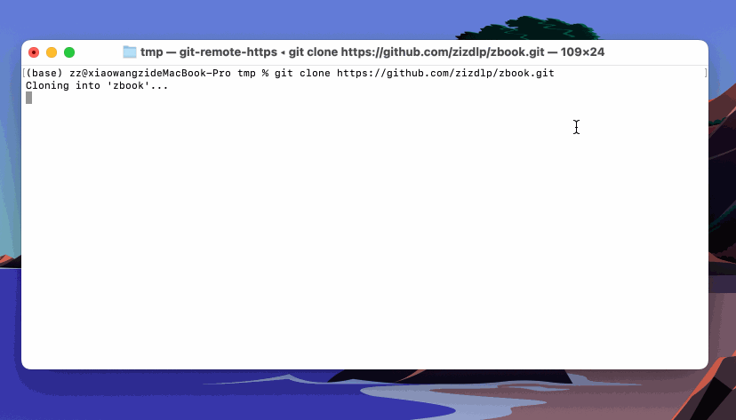

# Cloud Deployment

There are various ways to deploy applications in the cloud. Below is a guide on how to deploy using Docker Compose and Kubernetes. Since the application is already containerized, we recommend using Kubernetes for deployment to gain higher flexibility and scalability.

## 1. Deploying with Docker Compose

If the ZBook application is small and has low resource requirements, Docker Compose can be used for deployment. Docker Compose helps you quickly deploy containerized applications on either local or remote servers.

Here are the basic steps for deploying with Docker Compose:

1. **Clone the repository and enter the project directory**:

   ```bash
   git clone https://github.com/zizdlp/zbook.git
   cd zbook
   ```

2. **Run Docker Compose commands**:

   Use the `docker-compose` command to start the service:

   ```bash
   make compose_pull
   ```

   This command will pull the latest images and start the services.

   

3. **Configure environment variables**

   Configuring the correct environment variables is key to ensuring the service runs smoothly. The `compose.env` file contains various environment variables. You can modify the settings for PostgreSQL, MinIO, email services, WebSocket, OAuth authentication, and more. For details on these parameters and how to configure them, see [Configuration](使用/配置.md).

## 2. Deploying with Kubernetes

For more complex applications or if you want better scalability and management capabilities on the cloud platform, Kubernetes is recommended. Kubernetes helps you manage the lifecycle of containers, auto-scaling, and high availability.

### 2.1 Deploying with Kubernetes

Here are the basic steps for deploying with Kubernetes:

1. **Install a Kubernetes cluster**:

   You can use various Kubernetes distributions to create a cluster, such as **Minikube**, **kubeadm**, or **Managed Kubernetes Services** (like Google Kubernetes Engine, Amazon EKS, Azure Kubernetes Service).

2. **Write Kubernetes deployment files**:

   Create `deployment.yaml` and `service.yaml` files to define deployments and services in Kubernetes.

3. **Apply the configuration**:

   Use the `kubectl` command to apply the configuration to the cluster:

   ```bash
   kubectl apply -f deployment.yaml
   kubectl apply -f service.yaml
   ```

### 2.2 Lightweight Deployment with K3s

For resource-constrained environments or if you want a lightweight Kubernetes deployment locally, you can use **K3s**. K3s is a lightweight version of Kubernetes, suitable for edge computing, IoT, and development environments.

**Install K3s**:

1. **Download and run the K3s installation script**:

   Run the following command on your host to install K3s:

   ```bash
   curl -sfL https://rancher-mirror.rancher.cn/k3s/k3s-install.sh | INSTALL_K3S_MIRROR=cn INSTALL_K3S_EXEC="--disable=traefik" sh -
   ```

2. **Verify the installation**:

   After installation, you can use the `kubectl` command to verify the status of K3s:

   ```bash
   kubectl get nodes
   ```

   You should see the list of your nodes, indicating that K3s has been successfully installed.

### 2.3 Kubernetes YAML Configuration

Here is an example Kubernetes YAML configuration, including Persistent Volumes, Persistent Volume Claims, and Redis deployment:

**Persistent Volume and Persistent Volume Claim**

```yaml
kind: PersistentVolume
apiVersion: v1
metadata:
  name: zbook-redis-pv-volume
  labels:
    type: local
    app: zbook-redis
spec:
  storageClassName: manual
  capacity:
    storage: 1Gi
  accessModes:
    - ReadWriteMany
  hostPath:
    path: "/mnt/zbook/redis"
---
kind: PersistentVolumeClaim
apiVersion: v1
metadata:
  name: zbook-redis-pv-claim
  labels:
    app: zbook-redis
spec:
  storageClassName: manual
  accessModes:
    - ReadWriteMany
  resources:
    requests:
      storage: 1Gi
```

**Deployment Configuration**

```yaml
apiVersion: apps/v1
kind: Deployment
metadata:
  name: zbook-redis
spec:
  replicas: 1
  selector:
    matchLabels:
      app: zbook-redis
  template:
    metadata:
      labels:
        app: zbook-redis
    spec:
      containers:
        - name: zbook-redis
          image: redis:7-alpine
          ports:
            - containerPort: 6379
          volumeMounts:
            - name: redis-storage
              mountPath: /data # Mount path inside Redis container
      volumes:
        - name: redis-storage
          persistentVolumeClaim:
            claimName: zbook-redis-pv-claim # Name of the PVC created earlier
```

### 2.4 Installing with Helm

**Helm** is a package manager for Kubernetes that simplifies the deployment process. Here are the steps to deploy an application using Helm:

1. **Install Helm**:

   Follow the [Helm official documentation](https://helm.sh/docs/intro/install/) for instructions on installing Helm.

2. **Create a Helm Chart**:

   Use Helm to create a new chart:

   ```bash
   helm create zbook
   ```

   This generates a directory structure for a Helm chart, where you can define Kubernetes deployment configurations.

3. **Configure Helm Chart**:

   Configure your application settings in the `zbook/values.yaml` file. You can define environment variables, service settings, and more in `values.yaml`.

   !!! TIP TIP
        ZBook Helm chart: <https://github.com/zizdlp/zbook-helm-chart>. You need to first rename values_template.yaml to values.yaml, then fill in your own configuration details.

4. **Deploy the Application**:

   Use Helm to deploy the application to the Kubernetes cluster:

   ```bash
   helm install zbook ./zbook
   ```

   You can use `helm list` to check the deployment status and `helm upgrade` to update the application.

By following these steps, you can manage your application within a Kubernetes cluster and enjoy the benefits of container orchestration. For more detailed help, refer to the [Kubernetes official documentation](https://kubernetes.io/docs/home/), [K3s official documentation](https://rancher.com/docs/k3s/latest/en/), and [Helm official documentation](https://helm.sh/docs/intro/using_helm/).
