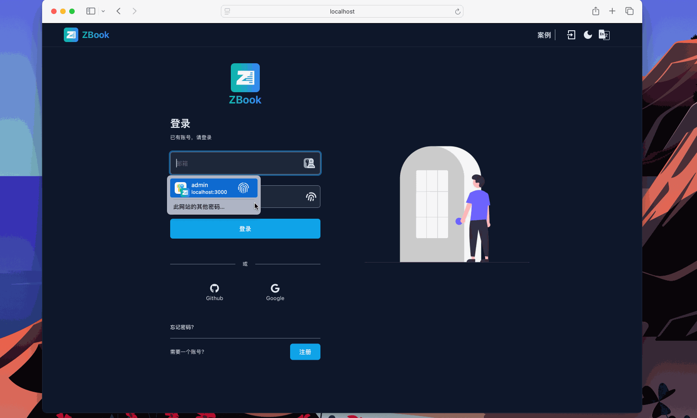

# ZBook Official Documentation

Welcome to ZBook, a fully open-source, full-stack knowledge management software designed for teams. This repository is the official documentation repository for ZBook. To access the ZBook source code, please visit [https://github.com/zizdlp/zbook](https://github.com/zizdlp/zbook). For the Chinese page, click [开始使用](../开始/开始使用.md).


<iframe width="560" height="315" src="https://www.youtube.com/embed/Wt6LEZTv79o?si=CaZAiI4ndROt9IFU" title="YouTube video player" frameborder="0" allow="accelerometer; autoplay; clipboard-write; encrypted-media; gyroscope; picture-in-picture; web-share" referrerpolicy="strict-origin-when-cross-origin" allowfullscreen></iframe>

## Quick Start

Welcome to the ZBook documentation guide. Follow these instructions to learn how to deploy, update, and enhance your ZBook documentation.

### 1. Install Dependencies

To run ZBook smoothly, you need to install Docker and Docker Compose. Please follow these steps:

- **Install Docker**: Docker is an open-source containerization platform used to build, run, and manage containerized applications. Visit the [Docker official website](https://docs.docker.com/get-docker/) for installation instructions suitable for your operating system.
- **Install Docker Compose**: Docker Compose is a tool for defining and running multi-container Docker applications. You can find installation instructions in the [Docker Compose official documentation](https://docs.docker.com/compose/install/).

Once installed, you can verify the installation by running the following commands:

```bash
docker --version
docker-compose --version
```

If these commands return the version information for Docker and Docker Compose, your dependencies are successfully installed.

### 2. Clone the Repository and Start the Service

You can start the ZBook service with just a few steps:

- First, clone the repository: Use the `git clone` command to clone the ZBook repository to your local machine.
- Change directory: Navigate into the `zbook` directory using the `cd` command.
- Start the service: Run the `make compose_pull` command to pull Docker images and start the service. This command pulls pre-built images from DockerHub to save time. If you need to build from source, execute `make compose_build` instead.

```bash
git clone https://github.com/zizdlp/zbook.git
cd zbook
make compose_pull
```

### 3. Create Your First Markdown Repository

Open your browser and navigate to `http://localhost:3000`. First, you need to register an administrator account and then log in (local test settings have email verification disabled).

After logging in, you'll be redirected to your personal homepage. In the sidebar, click on "Create Repository" to open a form. Fill in the repository name, style, and select the markdown repository `https://github.com/zizdlp/zbook-docs`. Complete the form and click submit to create the repository.



You can also use other markdown repositories (composed of markdown documents). For specific configuration, see [Features](../Features/CoreFeatures.md). Not sure about the supported markdown syntax? Click [Syntax](../Syntax/BasicSyntax.md).

## Done

Congratulations! You have successfully set up ZBook documentation. It looks great! Need support or want to provide feedback? You can join our community or contact us via email at: <zizdlp@gmail.com>.
