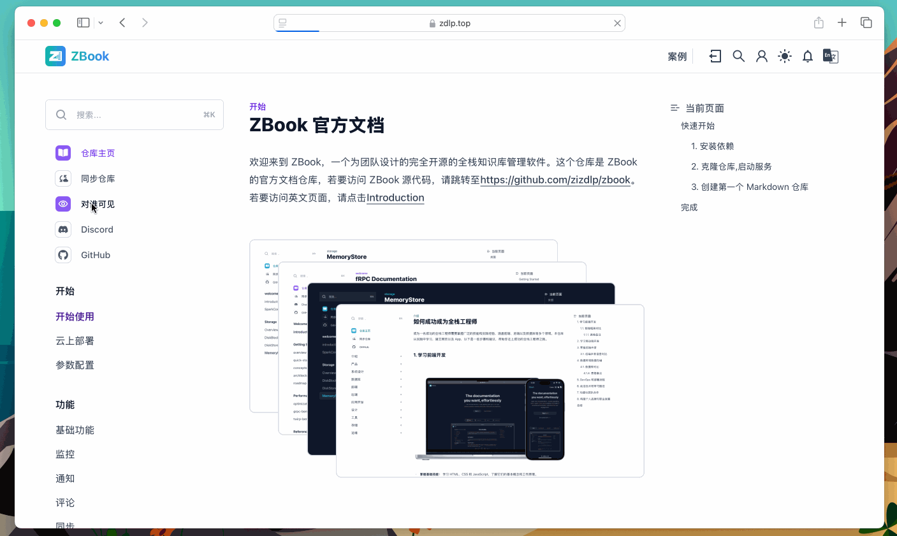

# 权限管理

用户可以创建不同可见权限的仓库，包括`仅创建者可见`、`仅登录可见`、`所有人可见`、`仅选中用户可见`。顾名思义，仅登录可见是用户登录可以看到仓库内容，仅选中用户可见是选中的用户群可见。

## 选中用户

当用户将仓库设为`仅选中用户可见`后，仓库侧边栏将会显示`对谁可见按钮`，点击可以看到谁可以看到此仓库，点击添加按钮，可以添加用户。

!!! Tip 注意
    这里无法更改仓库所有者的可见性，无论列表有无所有者，仓库所有者都可看到此仓库。

