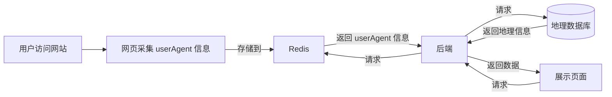
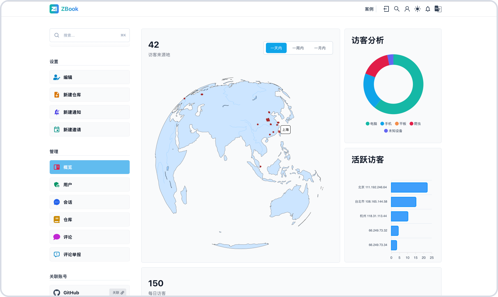
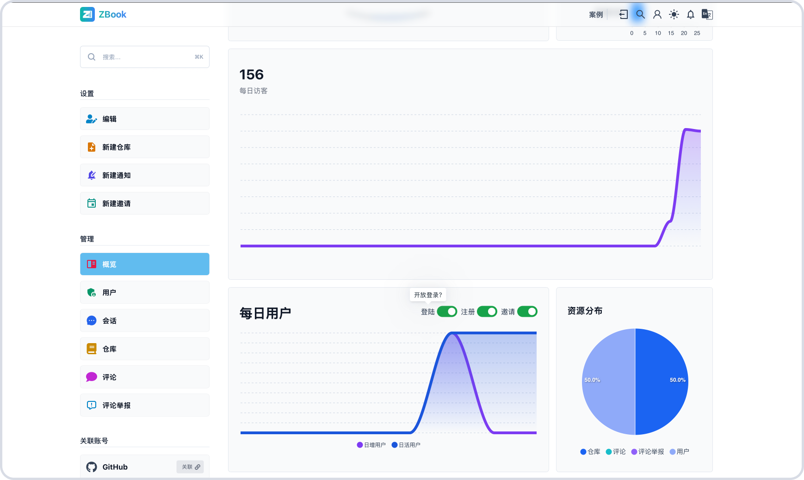

# 监控

监控访客、用户、会话、仓库、评论等信息。

## 概览

ZBook 会对访客信息进行采集和收集，比如 `IP 地址`、`访问时间`、`UserAgent` 等详细信息。采集到的数据将被存储在 `Redis` 中，并由后端进行汇总处理。管理员可以通过登录 ZBook，在仪表盘页面查看这些数据，通过可视化的方式展示和分析访客来源、设备类型、活跃访客等信息。访问记录将被进一步处理，如根据 IP 地址获取访客的地理位置信息，并在地理分布图上展示。

管理员可以使用这些数据来了解访客行为、优化网站性能，以及制定更有效的运营策略。整个过程确保数据的实时性和准确性，同时注重用户隐私的保护，只有具有管理员权限的账号才可以访问这些详细的访客分析数据。

### 访客信息概览

下图是 ZBook 的访客分析概览截图，提供对网站访客的详细监控和分析功能。页面包含以下关键组件：

- 访客来源地：显示了访问网站的访客的地理位置，通过地图直观展示访客的全球分布。地图上标记了每个访客的具体位置，管理员可以清楚地看到访客的来源城市和国家。
- 访问分析：通过饼状图展示了不同类型设备的访问比例，包括电脑、手机、平板、爬虫和未知设备。此图帮助管理员了解访客使用的设备类型，从而优化网站在各设备上的表现。
- 活跃访客：使用柱状图展示了访问次数最多的 IP 地址。每个条目展示了访客所在城市及其 IP 地址，管理员可以快速识别最活跃的访客群体。
- 总访客数与每日访客数：显示了总的访客数量以及每日的访客数量，有助于管理员跟踪网站的访问量变化趋势，及时了解流量高峰期。

通过这些功能，管理员可以深入分析访客行为，优化网站内容和用户体验，制定更有针对性的运营策略。

### 其他概览

下图也是 ZBook 的概览截图，包含如下几点功能：

- 访客数量：显示了过去一个月内，每天的访客人数，通过折线（曲线）直观展示访客的流量信息。
- 访问分析：通过饼状图展示了不同类型设备的访问比例，包括电脑、手机、平板、爬虫和未知设备。此图帮助管理员了解访客使用的设备类型，从而优化网站在各设备上的表现。
- 每日用户：使用折线图展示了过去一周新注册用户、登录用户的数量。此外提供了`登录`、`注册`、`邀请`几个按钮，若关闭登录按钮，则只有管理员账号可以登录，若关闭注册按钮，则新用户无法注册，若开启邀请按钮，则及时关闭注册按钮，邀请的用户依然可以注册。
- 资源分布：显示了当前用户数、仓库数、评论数等信息，有助于管理员跟踪网站的使用信息变化。

通过这些功能，管理员可以深入分析用户行为，优化网站内容和用户体验，制定更有针对性的运营策略。

