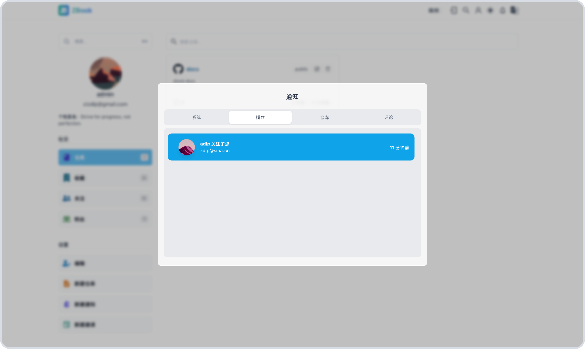
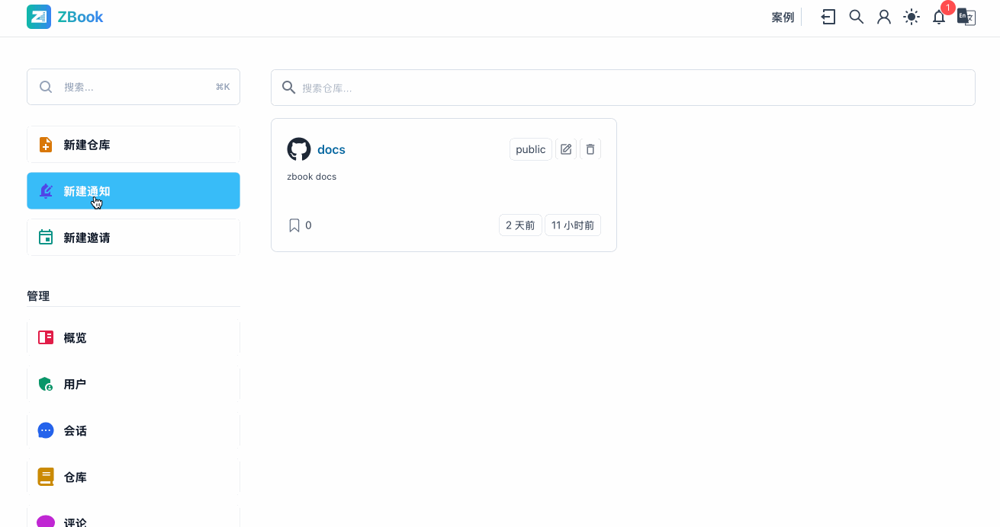

# 通知

ZBook 使用 `websocket` 推送通知给用户，包括`系统`、`仓库`、`粉丝`、`评论`等几个方面。其中`系统通知`主要是系统以及管理员发送的通知，仓库则是若其他用户(用户 A)关注了某个用户(用户 B),若用户 B 新建的可见仓库，用户 A 将会收到通知。类似的，`粉丝通知`则是通知用户 B 其他人(用户 A)关注了他。评论通知则是在其他人（用户 B）在用户 A 的仓库、用户 A 的评论下发表评论时通知用户 A。

## 系统通知

目前，新用户注册时，会有一条欢迎的的系统通知发送给新用户，包含使用说明的链接。除此之外，管理员也可以发送系统通知。具体的，管理员可以在其用户侧边栏点击新建系统通知，弹窗填入如下内容，点击确认即可。

| 参数   | 含义                                   |
| ------ | -------------------------------------- |
| 题目   | 通知标题                               |
| 用户名 | 通知哪个用户                           |
| 链接   | 可选，若提供链接，当用户点击时，会跳转 |
| 内容   | 通知的内容                             |

