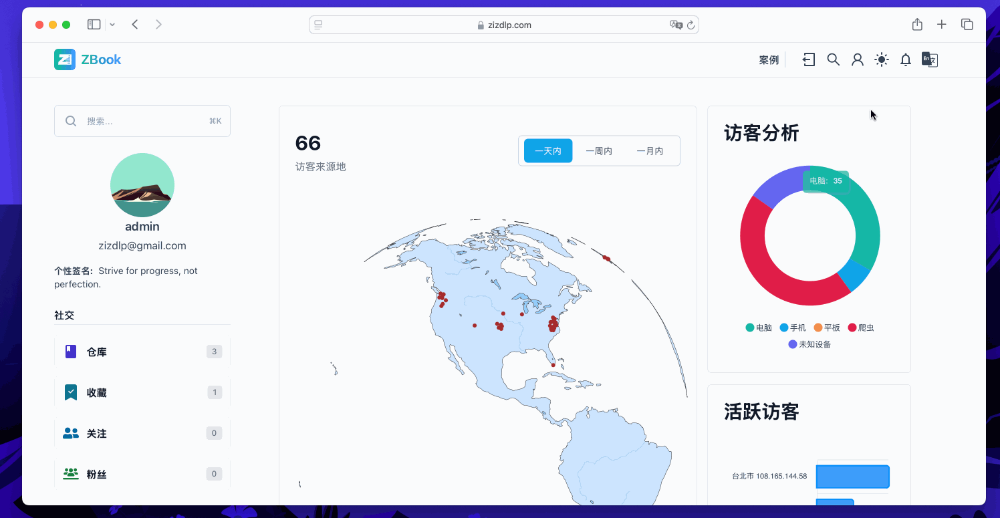

# 语言支持

## 前端部分

ZBook 目前支持简体中文和英文，要添加新的语言支持到 ZBook 的前端部分，你需要按照以下步骤进行修改：

### 1. 添加语言文件

在 `zbook_frontend/messages` 目录下创建一个新的语言文件，例如 `fr.json`，并在文件中添加相应的翻译内容。例如：

```json
{
  "welcome": "Bienvenue",
  "login": "Se connecter",
  "register": "S'inscrire",
  "dashboard": "Tableau de bord"
}
```

确保你为每个需要翻译的字段都提供了翻译内容。

### 2. 更新语言配置

在 `zbook_frontend/src/navigation.ts` 文件中，你需要将新的语言添加到 `locales` 配置中。例如，如果你要添加法语支持，可以这样做：

```typescript
import frMessages from "../messages/fr.json";

// 在 locales 对象中添加新的语言
const locales = {
  en: enMessages,
  zh: zhMessages,
  fr: frMessages, // 添加新的语言
};
```

### 3. 更新全局类型定义

在 `zbook_frontend/global.d.ts` 文件中，添加新的语言类型声明。你可能需要更新接口或类型定义，以便包含新的语言。例如：

```typescript
declare module "i18n" {
  type Locale = "en" | "zh" | "fr"; // 添加新的语言类型
}
```

### 4. 导航栏 语言切换

为了在 `navbar` 中实现语言切换，你需要更新相应的组件，使其支持从 `localeMap` 中选择语言。假设你有一个 `Navbar` 组件，你需要更新`zbook_frontend/src/components/navbars/NavLang.tsx`中的`localMap`,

```typescript
const localeMap = {
  en: "English",
  zh: "简体中文",
  de: "Deutsch",
  fr: "Français",
  es: "Español",
  jp: "日本語",
  ko: "한국어", // 添加新的语言
};
```

### 5. 测试

执行完上述步骤后，您可以先测试一下，进入`zbook_frontend`目录，执行`npm run lint`,`npm run build`,如果没有报错，您可以启动本地服务器，查看下效果。

## 后端

仪表盘可以支持多种语言的地理信息，这里和前端一定程度上是解耦合的，若后端没有对应语言的数据库信息，则后端会返回默认语言`en`的信息，如下图所示



如果您需要添加对应语言的后端版本，您需要更新后端以及数据库

```go
func getCityName(record *util.GeoInfo, lang string) string {
    switch lang {
    case "en":
      return record.CityNameEn
    case "zh_cn":
      return record.CityNameZhCn
    default:
      return record.CityNameEn
    }
}
```

!!! warning TODO
    后端添加语言的说明未完成，未完待续，您可以先（只）添加前端部分
