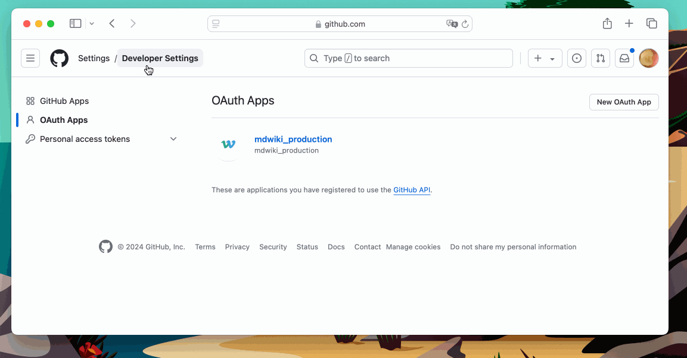

# 配置

本文档详细介绍了 ZBook 系统的各种配置参数。这些配置参数决定了系统的运行方式，包括文档仓库、认证方式、电子邮件设置、数据库连接以及存储配置等。

## 系统参数配置

系统参数配置主要涉及应用的基础设置、WebSocket 和后端服务的 URL、认证服务的配置等。

### 基础配置

以下是系统的基础配置参数:

- **DOC_REPONAME**: 设置首页“文档”按钮跳转的目标仓库名称。用户点击后，将会跳转到指定的 GitHub 仓库中查看文档内容。
- **DOC_USERNAME**: 设置首页“文档”按钮跳转的 GitHub 用户名。与 `DOC_REPONAME` 配合使用，确定文档链接的完整 URL。
- **BEIAN**: 网站的备案号。若设置了备案号，将在首页底部显示，符合中国大陆的法律要求。

```bash
DOC_REPONAME=docs  # 首页中文档按钮跳转的仓库的仓库名
DOC_USERNAME=admin # 首页中文档按钮跳转的仓库的用户名
BEIAN=""           # 备案号，若不为空，则在网站首页footer中显示
```


以下参数配置系统端口信息,若使用服务器，可以将示例中`localhost:ip`换成对应的域名：

- **WEBSOCKET_URL**: 设置 WebSocket 服务的 URL，供前端与 WebSocket 服务器进行实时通信。
- **BACKEND_URL**: 设置后端服务的 URL，前端将通过此 URL 访问后端 API。

- **AUTH_URL**: 设置认证服务的 URL，供系统进行用户认证。

- **AUTH_SECRET**: 用于加密和验证认证令牌的密钥，应设置为一个安全的随机字符串。

- **AUTH_TRUST_HOST**: 设置是否信任当前的主机名，用于认证过程中防止跨站点请求伪造（CSRF）攻击。若设置为 `true`，表示信任当前主机。

```bash
WEBSOCKET_URL=ws://localhost:9099
BACKEND_URL=http://localhost:8080
AUTH_URL=http://localhost:3000
AUTH_SECRET=abcdefghigklmnopgrstuvwxyz
AUTH_TRUST_HOST=true
```

### 认证配置

#### GitHub OAuth

GitHub OAuth 配置允许用户使用 GitHub 账号登录应用。配置参数包括 GitHub OAuth 客户端 ID 和客户端密钥。

```bash
GITHUB_ID=fake-github-id
GITHUB_SECRET=fake-github-secret
```

登录 github.com 账号，选择`Setttings`,然后下拉，选中下面的`Developer settings`,点击新建 Oauth APP，如下图所示配置各种参数。如果是在服务器上，可以将图中`localhost:port`换成自己的域名。



#### Google OAuth

Google OAuth 配置允许用户使用 Google 账号登录应用。配置参数包括 Google OAuth 客户端 ID 和客户端密钥。

### 电子邮件配置

电子邮件配置用于系统发送邮件通知或验证邮件。配置参数包括邮件发送者的名称、地址、SMTP 服务器地址和认证信息。

### 数据库配置

数据库配置涉及 PostgreSQL 数据库的连接信息，如数据库名称、用户名、密码等。确保这些信息配置正确，以便应用能够正常连接数据库。

### 存储配置

存储配置用于设置 MinIO 或其他存储服务的访问信息。配置参数包括存储服务的用户名、密码和存储桶的设置。

## 仓库参数配置

仓库参数配置主要用于设置文档仓库的相关信息。这些参数决定了系统如何与 GitHub 或其他代码托管平台上的文档仓库进行交互。

- **DOC_REPONAME**: 指定文档仓库的名称。前端的“文档”按钮将根据此参数跳转到对应的文档仓库。

- **DOC_USERNAME**: 指定文档仓库的用户名。用于生成文档仓库的完整 URL。

通过这些配置，ZBook 系统可以根据不同的需求进行定制，满足各种场景下的应用需求。如果需要更多关于配置的详细信息或帮助，请参考相关的技术文档或联系支持团队。
