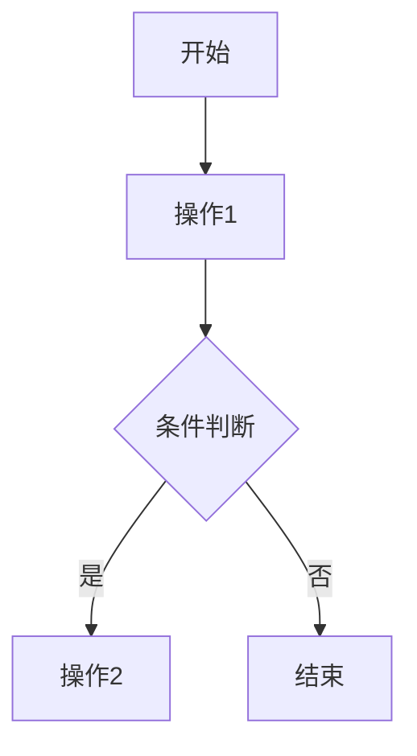

# 公式以及代码

ZBook 提供了强大的公式与代码支持，使用户能够在文档中轻松插入数学公式和编程代码，满足各种学术研究和开发文档的需求。

## 公式支持

ZBook 支持 LaTeX 语法，用户可以使用 LaTeX 编写复杂的数学公式，并将其直接嵌入 Markdown 文档中。以下是一些示例：

### 行内公式

行内公式用于在文本中插入简单的数学表达式：

```markdown
这是一个行内公式：`$E = mc^2$`，它表示能量和质量的关系。
```

**效果**: 这是一个行内公式：$E = mc^2$，它表示能量和质量的关系。

### 块级公式

块级公式用于显示更复杂的公式，通常位于文本的单独一行：

```markdown
$$
\int_{a}^{b} f(x) \, dx = F(b) - F(a)
$$
```

**效果**:

$$
\int_{a}^{b} f(x) \, dx = F(b) - F(a)
$$

## 代码支持

ZBook 允许用户插入带有语法高亮的代码块，适用于多种编程语言。用户可以轻松展示代码示例，并通过语法高亮提高代码的可读性。

### 行内代码

行内代码用于在文本中插入简短的代码或命令：

```markdown
使用 `print("Hello, World!")` 来输出信息。
```

**效果**: 使用 `print("Hello, World!")` 来输出信息。

### 块级代码

块级代码用于展示多行代码，用户可以指定代码语言，以启用语法高亮：

````markdown
```python
def hello():
    print("Hello, World!")
```
````

**效果**:

```python
def hello():
    print("Hello, World!")
```

### 语法高亮

ZBook 支持多种编程语言的语法高亮，适用于 Python、JavaScript、Go 等语言。以下是一个 JavaScript 代码示例：

````markdown
```javascript
function greet(name) {
  return `Hello, ${name}!`;
}
```
````

**效果**:

```javascript
function greet(name) {
  return `Hello, ${name}!`;
}
```

## Mermaid 支持

ZBook 支持使用 Mermaid 语法绘制各种图表，包括流程图、时序图、类图等，使文档内容更加可视化。

### 流程图示例

以下是一个简单的流程图示例：

````markdown

````

**效果**:

```mermaid
graph TD
    A[开始] --> B[操作1]
    B --> C{条件判断}
    C -->|是| D[操作2]
    C -->|否| E[结束]
````
